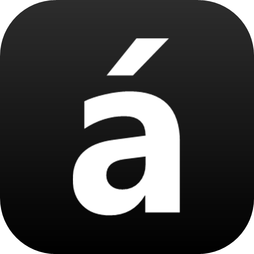

<div align="center">
  

  # MacAccents

  **Type accented characters on Windows the way you do on a Mac.**

  Hold down a letter and pick an accented version (á à â ä …) from a little
  popup, anywhere, in any app. No more fiddling to type `ä`, `ö`, `ü`, `ß`,
  `é`, `ñ` …

  
</div>

## What it does

On a Mac, holding a key like `a` shows a menu of accented letters. Windows just
repeats the key (`aaaa`). **MacAccents brings that Mac behaviour to Windows**,
system-wide, in every application.

- Hold a letter, and a popup shows its accented variants.
- Pick one, and it replaces the letter. Done.
- Works with your normal keyboard layout.
- Sits quietly in the system tray, with no window in your way.

## Getting started

1. Download the latest **MacAccentsSetup** from the
   [Releases](../../releases) page.
2. Run it and follow the installer. A small black **á** icon appears in your
   system tray (bottom-right, near the clock).
3. That’s it. Start typing.

To have it always ready, enable **Launch at Windows startup** in the settings
(see below).

## How to use it

1. Press and **hold** a letter that has accents: vowels (`a e i o u`) and some
   consonants (`n c s y z …`).
2. After a moment a popup appears with the variants.
3. **Choose one**:
   - press the **number** shown under it (`1` to `9`),
   - or move with **← / →** or **Tab / Shift+Tab** and press **Enter**,
   - or simply **click** it.
4. Changed your mind? Press **Esc** to keep the plain letter.

A quick tap still types the normal letter, exactly as before.

## Settings

Right-click the tray icon (or double-click it) and choose **Settings…**:

- **Hold delay**: how long you hold a key before the popup appears.
- **Launch at Windows startup**: start MacAccents automatically when you log in.

To quit, right-click the tray icon and choose **Exit**.

## Good to know

- MacAccents can’t type into windows that run **as administrator** (for example
  some system dialogs). Everyday apps like browsers, Office, editors and chat all
  work fine.
- The popup appears at your text cursor. If an app doesn’t report where that is,
  it appears near your mouse pointer instead.

## Build from source

Requires the [.NET 10 SDK](https://dotnet.microsoft.com/download):

```powershell
dotnet run -c Release
```

## License

MacAccents is proprietary software. © 2026 Brielmayer Consulting GmbH.
All rights reserved. See [LICENSE](LICENSE).

You may download and run the official installer for personal and internal
business use. The source code is provided for transparency only and may not be
reused, modified, or redistributed without written permission.
